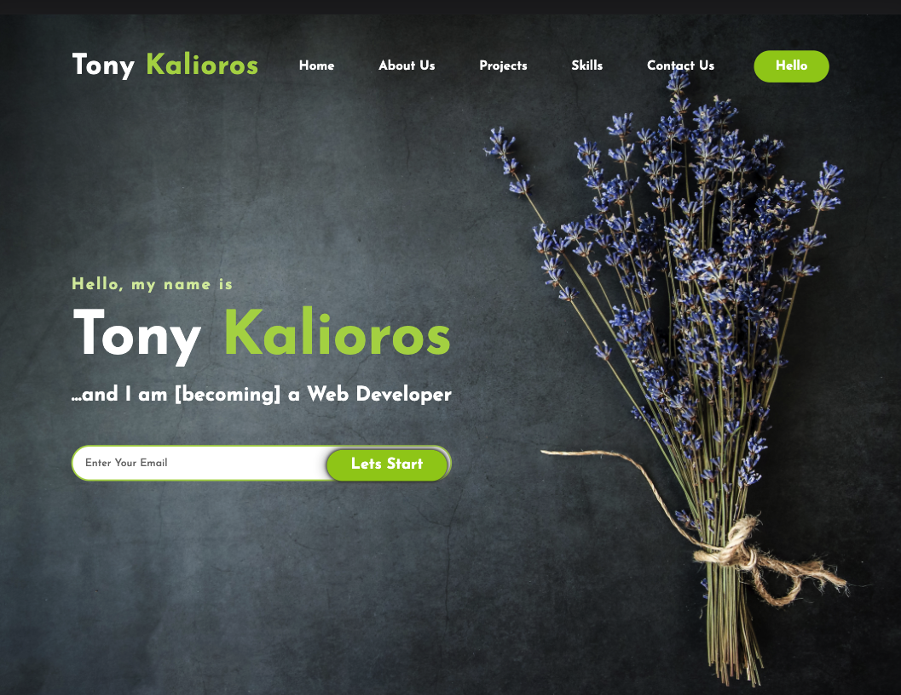

## Version 1.0 of my Personal Portfolio.

## Visit the Live App

https://nolie88.github.io/TK_Portfolio/

## Project

Create a personal portolio using HTML and CSS.

## Completed requirements:

The user required the below:

1. A portfolio that uncludes samples of previous work.
2. Portolio to include name, profile photo, about me and projects section.
3. Links which point to the correct sections.
4. Links of previous work which show a live app.

```

## Web App Preview
The following image shows the web application's appearance and functionality:


```
